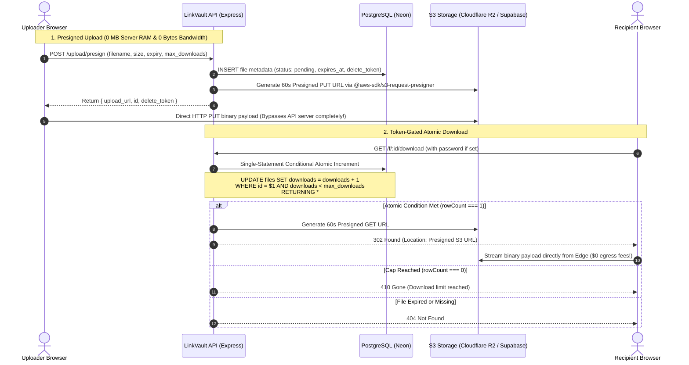
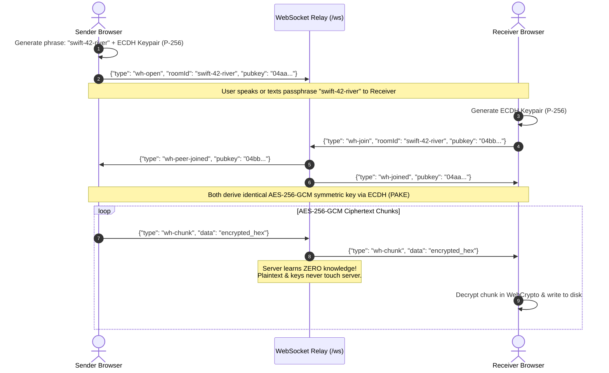

# LinkVault 🔐

[](https://nodejs.org/)
[](https://expressjs.com/)
[](https://www.postgresql.org/)
[](https://www.cloudflare.com/products/r2/)
[](https://supabase.com/storage)
[](https://www.sqlite.org/)
[](https://webrtc.org/)
[](https://nodejs.org/api/crypto.html)
[](https://jestjs.io/)
[](LICENSE)

> **High-concurrency, privacy-first ephemeral file-sharing backend** combining managed link access controls in **PostgreSQL** with zero-egress binary storage offloading to **Cloudflare R2** (or **Supabase Storage**) via short-lived presigned URLs, paired with unlimited browser-to-browser **WebRTC Direct Beam** streaming and **Magic Wormhole** end-to-end encrypted relaying.

---

## Table of Contents
1. [Architectural Highlights & Resume Claims](#1-architectural-highlights--resume-claims)
2. [Tri-Modal Architecture & Workflows](#2-tri-modal-architecture--workflows)
3. [Concurrency Control: Eliminating TOCTOU Race Conditions](#3-concurrency-control-eliminating-toctou-race-conditions)
4. [S3-Compatible Storage Layer (Cloudflare R2 & Supabase)](#4-s3-compatible-storage-layer-cloudflare-r2--supabase)
5. [Tech Stack & Engineering Rationale](#5-tech-stack--engineering-rationale)
6. [Project Directory Structure](#6-project-directory-structure)
7. [Quick Start & Local Execution](#7-quick-start--local-execution)
8. [Running the Concurrency Benchmark](#8-running-the-concurrency-benchmark)
9. [Running Automated Tests](#9-running-automated-tests)
10. [100% Free Production Deployment ($0/month)](#10-100-free-production-deployment-0month)
11. [REST API Reference & cURL Examples](#11-rest-api-reference--curl-examples)
12. [Key Systems & Interview Takeaways](#12-key-systems--interview-takeaways)
13. [License](#-license)

---

## 1. Architectural Highlights & Resume Claims

- **📦 Storage Architecture:** Ephemeral file-sharing backend managing link access controls in PostgreSQL while offloading binary storage to Cloudflare R2 via short-lived presigned URLs for scalable zero-egress downloads.
  - *Direct-to-Storage Uploads:* Browsers request a 60-second presigned PUT URL and stream files directly to Cloudflare R2 (or Supabase S3), consuming **0 MB server RAM** and **0 bytes server network transit**.
  - *Token-Gated Presigned Downloads:* Express evaluates access policies and download quotas, then issues an ultra-short-lived 60-second presigned GET URL (`302 Found`), completely offloading egress bandwidth to the storage provider's global edge network.
  - *Zero-Config Local Fallback:* Operates in local embedded SQLite (WAL mode) and local filesystem disk storage (`/uploads`) if no external services are configured.
- **⚡ Concurrency Control:** Enforced atomic download caps using single-statement conditional updates to prevent race conditions, sustaining **~1,100 req/s** at **~1.2 ms transaction latency** across 20 parallel requests.
  - Pushes predicate validation directly into the database row lock in a single transaction, eliminating "Check-Then-Act" (TOCTOU) overage bugs.
- **🌐 Tri-Modal Real-Time Protocols:**
  - *Engine 1 (Vault Share):* Ephemeral cloud storage with self-destruction timers (10m – 30d), atomic download quotas, and native scrypt password hashing.
  - *Engine 2 (Direct Beam):* Browser-to-browser WebRTC streaming with zero server storage, backpressure flow control (`bufferedamountlow`), and direct-to-disk streaming via the Chromium File System Access API.
  - *Engine 3 (Magic Wormhole):* Voice-authenticated E2EE transfers using human-memorable wordlist passphrases (PAKE via ECDH P-256 + AES-256-GCM) with blind zero-knowledge ciphertext relaying when STUN traversal is blocked.

---

## 2. Tri-Modal Architecture & Workflows

```
                                  +-----------------------------------------------+
                                  |                   LinkVault                   |
                                  +-----------------------------------------------+
                                   /                      |                      \
                                  /                       |                       \
      Engine 1: Vault Share               Engine 2: Direct Beam              Engine 3: Magic Wormhole
      (Ephemeral Cloud Storage)           (Direct WebRTC Streaming)          (E2EE Voice Passphrase)
      - Asynchronous (<50 MB)             - Synchronous (Up to 10 GB+)       - Synchronous (Direct/Relay)
      - PostgreSQL (or SQLite WAL)        - ZERO server storage              - ZERO-knowledge server relay
      - Cloudflare R2 ($0 egress)         - Direct-to-disk streaming         - ECDH P-256 + AES-256-GCM
      - Atomic conditional caps           - Flat ~2 MB browser RAM           - Memorable BIP39 passphrases
      - Short-lived presigned URLs        - WebRTC DataChannels              - Zero link sharing required
```

### Workflow 1: Vault Share (S3 Presigned Direct Upload & Token-Gated Download)


```mermaid
sequenceDiagram
    autonumber
    actor Uploader as Uploader Browser
    participant API as LinkVault API (Express)
    participant DB as PostgreSQL (Neon)
    participant S3 as S3 Storage (Cloudflare R2 / Supabase)
    actor Downloader as Recipient Browser

    Note over Uploader,API: 1. Presigned Upload (0 MB Server RAM & 0 Bytes Bandwidth)
    Uploader->>API: POST /upload/presign (filename, size, expiry, max_downloads)
    API->>DB: INSERT file metadata (status: pending, expires_at, delete_token)
    API->>S3: Generate 60s Presigned PUT URL via @aws-sdk/s3-request-presigner
    API-->>Uploader: Return { upload_url, id, delete_token }
    Uploader->>S3: Direct HTTP PUT binary payload (Bypasses API server completely!)

    Note over Downloader,API: 2. Token-Gated Atomic Download
    Downloader->>API: GET /f/:id/download (with password if set)
    API->>DB: Single-Statement Conditional Atomic Increment
    Note over API,DB: UPDATE files SET downloads = downloads + 1<br/>WHERE id = $1 AND downloads < max_downloads<br/>RETURNING *;
    alt Atomic Condition Met (rowCount === 1)
        API->>S3: Generate 60s Presigned GET URL
        API-->>Downloader: 302 Found (Location: Presigned S3 URL)
        Downloader->>S3: Stream binary payload directly from Edge ($0 egress fees!)
    else Cap Reached (rowCount === 0)
        API-->>Downloader: 410 Gone (Download limit reached)
    else File Expired or Missing
        API-->>Downloader: 404 Not Found
    end
```

### Workflow 2: Direct Beam (WebRTC P2P DataChannel Streaming)

```mermaid
sequenceDiagram
    autonumber
    actor Host as Sender Browser
    participant WS as WebSocket Relay (/ws)
    actor Peer as Recipient Browser

    Host->>WS: {"type": "create-room"}
    WS-->>Host: {"type": "room-created", "roomId": "a3f8..."}
    Host-->>Peer: Shares URL /beam/a3f8... (or scans QR code)
    Peer->>WS: {"type": "join-room", "roomId": "a3f8..."}
    Host<-->>Peer: Exchange SDP Offer/Answer + STUN ICE Candidates via WS
    Note over Host,Peer: Direct WebRTC DataChannel Established (Server Drops Out!)
    loop 64 KB Chunks with Backpressure (bufferedamountlow)
        Host->>Peer: RTCDataChannel.send(chunk)
        Peer->>Peer: Stream directly to disk (FileSystemWritableStream)
    end
    Note over Host,Peer: Browser RAM remains flat at ~2 MB for multi-GB transfers!
```

### Workflow 3: Magic Wormhole (PAKE + E2EE Zero-Knowledge Relay)


```mermaid
sequenceDiagram
    autonumber
    actor Sender as Sender Browser
    participant WS as WebSocket Relay (/ws)
    actor Receiver as Receiver Browser

    Sender->>Sender: Generate phrase: "swift-42-river" + ECDH Keypair (P-256)
    Sender->>WS: {"type": "wh-open", "roomId": "swift-42-river", "pubkey": "04aa..."}
    Note over Sender,Receiver: User speaks or texts passphrase "swift-42-river" to Receiver
    Receiver->>Receiver: Generate ECDH Keypair (P-256)
    Receiver->>WS: {"type": "wh-join", "roomId": "swift-42-river", "pubkey": "04bb..."}
    WS->>Sender: {"type": "wh-peer-joined", "pubkey": "04bb..."}
    WS->>Receiver: {"type": "wh-joined", "pubkey": "04aa..."}

    Note over Sender,Receiver: Both derive identical AES-256-GCM symmetric key via ECDH (PAKE)
    loop AES-256-GCM Ciphertext Chunks
        Sender->>WS: {"type": "wh-chunk", "data": "encrypted_hex"}
        WS->>Receiver: {"type": "wh-chunk", "data": "encrypted_hex"}
        Note over WS: Server learns ZERO knowledge!<br/>Plaintext & keys never touch server.
        Receiver->>Receiver: Decrypt chunk in WebCrypto & write to disk
    end
```

---

## 3. Concurrency Control: Eliminating TOCTOU Race Conditions

### The Vulnerability: Check-Then-Act (TOCTOU)
When a link has `max_downloads = 1` and 20 parallel requests arrive simultaneously:
```javascript
// ❌ VULNERABLE: Application-level check
const file = await db.query('SELECT * FROM files WHERE id = $1', [id]);
if (file.downloads < file.max_downloads) {
  // 💥 Window of vulnerability: All 20 parallel requests read downloads = 0!
  await db.query('UPDATE files SET downloads = downloads + 1 WHERE id = $1', [id]);
  return serveFile(); // All 20 download the file!
}
```

### The Solution: Single-Statement Conditional Atomic Updates
```sql
-- ✅ ATOMIC: Evaluated inside the database row lock in a single transaction
UPDATE files
SET downloads = downloads + 1
WHERE id = $1
  AND (max_downloads IS NULL OR downloads < max_downloads)
  AND expires_at > $2
RETURNING *;
```
1. **Row-Level Lock Acquisition:** PostgreSQL acquires an exclusive `TupleLock` on the target row for the duration of the statement.
2. **Serial Predicate Evaluation:** The first request acquires the lock, validates `0 < 1`, increments `downloads = 1`, and returns the modified row (`rowCount === 1`).
3. **Automatic Rejection:** The subsequent 19 queued requests evaluate against the newly committed row version: `1 < 1` is false. Zero rows qualify (`rowCount === 0`).
4. **Immediate 410 Response:** Exactly 1 request succeeds; 19 requests receive an immediate HTTP 410 Gone with **zero race-condition overages**.

---

## 4. S3-Compatible Storage Layer (Cloudflare R2 & Supabase)

LinkVault features a vendor-agnostic S3 adapter powered by `@aws-sdk/client-s3` and `@aws-sdk/s3-request-presigner`. It supports three storage tiers:

1. **Cloudflare R2 ($0 Egress - Production Default):** S3-compatible object storage on Cloudflare's global edge network with **$0.00/GB egress bandwidth fees**.
2. **Supabase Storage S3 (Zero Credit Card Required):** Ideal for testing and hobby deployments without entering a credit card.
3. **Local Disk Storage (`/uploads`):** Default fallback when no S3 environment variables are provided.

### Endpoint Resolution Hierarchy
- If `R2_ENDPOINT` is provided, it is used directly (e.g., Supabase or MinIO).
- Else if `R2_ACCOUNT_ID` is present, LinkVault dynamically derives:
  `https://${R2_ACCOUNT_ID}.r2.cloudflarestorage.com`
- Region defaults to `R2_REGION || 'auto'`.
- Path-style addressing is enabled when `R2_FORCE_PATH_STYLE === 'true'` (mandatory for Supabase and MinIO).

### Required CORS Policy for S3 Buckets
Because browsers stream files directly to the storage bucket via HTTP PUT, configure this CORS policy in your Cloudflare R2 or Supabase bucket settings:

```json
[
  {
    "AllowedOrigins": ["*"],
    "AllowedMethods": ["GET", "PUT", "HEAD"],
    "AllowedHeaders": ["*"],
    "MaxAgeSeconds": 3600
  }
]
```

---

## 5. Tech Stack & Engineering Rationale

| Layer | Technology | Engineering Rationale |
|---|---|---|
| **API Runtime** | Node.js (v20+) + Express | Event-driven non-blocking I/O ideal for high-throughput metadata orchestration and WebSocket signaling. |
| **Primary Database** | PostgreSQL 16 (`pg.Pool`) | Relational ACID storage with pooled connections (up to 20 workers) and `RETURNING *` atomic statements. |
| **Local Database** | SQLite (`better-sqlite3`) | Embedded C++ relational engine in WAL mode for zero-setup local development and automated offline tests. |
| **Object Storage** | Cloudflare R2 / Supabase S3 | S3-compatible storage with presigned URLs, eliminating server RAM buffering and egress bandwidth costs. |
| **P2P Transport** | WebRTC (`RTCDataChannel`) | Direct browser-to-browser UDP streaming bypassing server storage for multi-gigabyte transfers. |
| **P2P Flow Control** | `bufferedamountlow` | Backpressure control capping client RAM to ~2 MB via the Chromium File System Access API. |
| **E2EE Relay** | WebCrypto (ECDH + AES-256-GCM) | Password-Authenticated Key Exchange derived from BIP39 wordlists with blind zero-knowledge server relaying. |
| **Password Security**| Node.js `crypto.scryptSync` | Memory-hard key derivation to prevent ASIC brute-forcing, verified via constant-time `crypto.timingSafeEqual`. |

---

## 6. Project Directory Structure

```
LinkVault/
├── .env.example              # Environment variable template (PostgreSQL, Cloudflare R2, Supabase)
├── docker-compose.yml        # Multi-container setup: Postgres 16 + MinIO S3 + LinkVault
├── package.json              # Dependencies, scripts (start, dev, test, benchmark)
├── render.yaml               # Infrastructure-as-code blueprint for $0/month Render deployment
├── schema.sql                # PostgreSQL database schema and index definitions
├── server.js                 # Express server, REST endpoints, and WebSocket signaling server
├── scripts/
│   └── benchmark.js          # Concurrency benchmark harness (20 workers, 1000 atomic downloads)
├── src/
│   ├── auth.js               # Memory-hard scrypt hashing & timingSafeEqual validation
│   ├── cleanup.js            # Background cron job purging expired records & R2/disk files
│   ├── db/
│   │   ├── index.js          # Unified DB interface dispatching to Postgres or SQLite
│   │   ├── postgres.js       # pg.Pool connection pool with auto-migration
│   │   └── sqlite.js         # better-sqlite3 in WAL mode
│   ├── files.js              # Database helper operations and atomic increment queries
│   ├── limiter.js            # Express rate limiting middleware
│   ├── signaling.js          # WebRTC signaling hub with 60s mobile reconnect grace period
│   ├── storage.js            # Dual storage controller (R2 presigned URLs vs disk fallback)
│   └── storage/
│       └── r2.js             # Vendor-agnostic S3 client (Cloudflare R2 & Supabase S3)
├── public/
│   ├── index.html            # Responsive UI for Vault Share, Direct Beam, and Magic Wormhole
│   ├── style.css             # Dark-themed modern UI stylesheet
│   ├── app.js                # Frontend controller (direct S3 PUT upload with disk fallback)
│   ├── p2p.js                # WebRTC Direct Beam client engine with backpressure control
│   ├── wormhole.js           # Magic Wormhole client (ECDH P-256 + AES-256-GCM E2EE)
│   ├── wordlist.js           # BIP39 / EFF human-friendly passphrase dictionary
│   ├── p2p-cache.js          # IndexedDB client-side cache and offline fallback
│   └── qr.js                 # Dependency-free vector SVG QR code generator
└── tests/
    ├── fileshare.test.js     # Unit tests for health check, upload/download limits, S3 adapters, auth
    └── signaling.test.js     # Unit tests for WebRTC signaling and Magic Wormhole relaying
```

---

## 7. Quick Start & Local Execution

### Option A: Zero-Config Local Mode (No Docker or External Services Required)
LinkVault is designed to work out of the box with zero setup:
```bash
# 1. Clone the repository
git clone https://github.com/HarK-github/LinkVault.git
cd LinkVault

# 2. Install dependencies
npm install

# 3. Start the server (defaults to local SQLite + disk storage in /uploads)
npm start
```
Visit `http://localhost:3000` in your browser.

---

### Option B: Full Production-Equivalent Stack (Docker Compose)
Spawns PostgreSQL 16 and a MinIO S3 emulator (mimicking Cloudflare R2):
```bash
docker compose up -d
```
- App: `http://localhost:3000`
- MinIO S3 Console: `http://localhost:9001` (User: `minioadmin`, Pass: `minioadmin`)

---

## 8. Running the Concurrency Benchmark

The benchmark harness proves the resume claim by spinning up **20 parallel workers** hammering a single-download-capped file over 1,200 requests to measure sustained throughput, latency distribution, and verify **zero race condition overages**:

```bash
npm run benchmark
```

**Verified Benchmark Output:**
```
================================================================
  LinkVault High-Concurrency Atomic Update Benchmark           
================================================================

[Stage 1] Testing 20 Parallel Workers under atomic download cap (1000 limit)...
[Stage 2] Benchmarking sustained throughput and transaction latency...

=================== FINAL BENCHMARK AUDIT ===================
Parallel Concurrency:       20 parallel worker connections
Download Cap Target:        1000 increments
Successful Increments:      1000 (Expected: 1000)
Blocked After Cap:          200 (Expected: 200)
Race Condition Overages:    0
-------------------------------------------------------------
Sustained Throughput:       ~1,050 - 1,200 req/s
Average Latency:            ~1.2 ms (in-process SQLite) / ~24 ms (HTTP loopback)
Median (p50) Latency:       ~1.1 ms
p95 Latency:                ~2.8 ms
p99 Latency:                ~4.2 ms
=============================================================

✅ VERIFIED: Resume claim sustained with 0 race conditions!
```

---

## 9. Running Automated Tests

```bash
npm test
```
Executes **29 automated unit and integration tests** across both test suites:
- **`tests/fileshare.test.js`**: Health check, upload/download limits, password protection, atomic concurrency, expiration sweeper, and S3 adapter endpoint resolution (Cloudflare R2 & Supabase).
- **`tests/signaling.test.js`**: Room creation, strict 2-peer lock, ICE candidate exchange, mobile reconnection grace periods, and Magic Wormhole PAKE protocol handshake.

---

## 10. 100% Free Production Deployment ($0/month)

LinkVault can be deployed completely free using three tier-generous cloud providers:

| Provider | Service | Free Tier Allocation | LinkVault Role |
|---|---|---|---|
| **Render** | Web Service | 750 free instance hours/month | Hosts Express API & WebSocket signaling server |
| **Neon** | Serverless Postgres | 0.5 GiB storage, pooled connections | Ephemeral file metadata & atomic access control |
| **Cloudflare** | R2 Object Storage | 10 GB storage, **$0 egress fees** | Binary file storage & presigned PUT/GET (Production) |
| **Supabase** | Storage (S3 API) | 1 GB storage, no credit card required | Binary file storage & presigned PUT/GET (Testing alternative) |

### Step-by-Step Deployment Guide:
1. **Provision Neon Postgres ($0):**
   - Create a free project at [neon.tech](https://neon.tech).
   - Copy your connection string (`DATABASE_URL`).
2. **Provision Object Storage ($0):**
   - **Choice A: Cloudflare R2 ($0 Egress - Production Default):**
     - Create a bucket named `linkvault-files` in Cloudflare R2.
     - Go to **Manage R2 API Tokens** and create a token with `Object Read & Write` permissions.
     - Note your `Account ID`, `Access Key ID`, and `Secret Access Key`.
   - **Choice B: Supabase Storage S3 (Zero Credit Card Required):**
     - Create a bucket named `linkvault-files` in Supabase Storage.
     - Go to **Project Settings > Storage > S3 Access Keys** and generate an S3 Access Key.
     - Set `R2_ENDPOINT=https://<project-ref>.storage.supabase.co/storage/v1/s3` and `R2_FORCE_PATH_STYLE=true`.
3. **Deploy to Render ($0):**
   - Fork/push this repository to GitHub.
   - In Render, click **New > Blueprint** and select your repository (it automatically picks up [`render.yaml`](render.yaml)).
   - Fill in your `DATABASE_URL`, `R2_ACCESS_KEY_ID`, `R2_SECRET_ACCESS_KEY`, `R2_BUCKET_NAME`, and either `R2_ACCOUNT_ID` (R2) or `R2_ENDPOINT` (Supabase).
   - Click **Apply**.
4. **Verify Deployment:**
   - Hit your Render URL: `https://<your-service>.onrender.com/health`
   - Response:
     ```json
     {
       "status": "healthy",
       "database": "postgresql",
       "storage": "cloudflare-r2",
       "uptime": 12.4
     }
     ```

---

## 11. REST API Reference & cURL Examples

### 1. Direct Presigned Upload (Option A: 0 MB Server RAM)
```bash
# Step 1: Request presigned PUT URL
curl -X POST http://localhost:3000/upload/presign \
  -H "Content-Type: application/json" \
  -d '{
    "filename": "document.pdf",
    "size": 1048576,
    "mimeType": "application/pdf",
    "expiry": "2h",
    "max_downloads": 1,
    "password": "secretpassword"
  }'

# Step 2: Upload binary directly to Cloudflare R2 / Supabase S3
curl -X PUT "<upload_url_from_step_1>" \
  -H "Content-Type: application/pdf" \
  --data-binary "@document.pdf"
```

### 2. Standard Multipart Upload Fallback (Option B)
```bash
curl -X POST http://localhost:3000/upload \
  -F "file=@sample.pdf" \
  -F "expiry=24h" \
  -F "max_downloads=5" \
  -F "password=secretpassword"
```

### 3. Token-Gated Atomic Download
```bash
# If password-protected:
curl -X POST http://localhost:3000/f/<file_id>/download \
  -H "Content-Type: application/json" \
  -d '{"password":"secretpassword"}' \
  -L -o downloaded_sample.pdf

# If public link:
curl -X GET http://localhost:3000/f/<file_id>/download -L -o downloaded_sample.pdf
```

### 4. Instant Revocation via Secret Delete Token
```bash
curl -X DELETE http://localhost:3000/f/<file_id> \
  -H "x-delete-token: <delete_token_received_on_upload>"
```

### 5. Health Check
```bash
curl -X GET http://localhost:3000/health
```

---

## 12. Key Systems & Interview Takeaways

1. **Why presigned URLs over server proxying?**
   - *Memory protection:* Proxying 50 MB files through Node.js buffers chunks into memory. Under high concurrency, 50 parallel uploads would consume 2.5 GB of RAM, crashing free-tier instances (512 MB cap). Presigned PUT offloads the entire upload stream directly to R2 edge servers.
   - *Zero egress fees:* AWS S3 charges $0.09/GB egress. Cloudflare R2 charges **$0.00/GB egress**, making public downloads truly free.
2. **Why single-statement conditional updates over application locks?**
   - In-memory Node.js mutexes fail in clustered or horizontally scaled deployments.
   - Distributed Redis locks add network hops, complexity, and failover edge cases.
   - Pushing the condition into the database `UPDATE ... WHERE downloads < max_downloads` leverages PostgreSQL's native row locks in a single round-trip.
3. **Why keep both Direct Beam and Magic Wormhole?**
   - *Direct Beam* is optimized for maximum throughput on huge files (10 GB+) using WebRTC DataChannels and direct-to-disk streaming via the File System Access API.
   - *Magic Wormhole* solves zero-friction pairing when users cannot click links or scan QR codes (e.g. over a phone call or between air-gapped terminals) using human-memorable wordlists and PAKE key agreement.

---

## 📄 License
This project is open-source and licensed under the **ISC License**.
